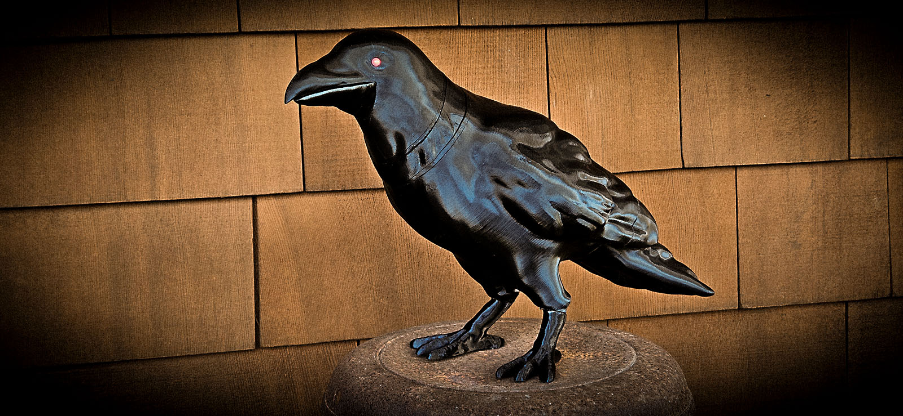
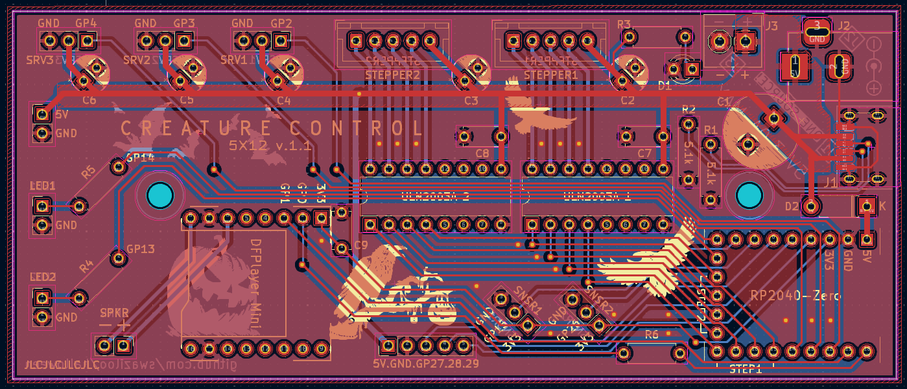

# Hallowe'en Projects #

___
## [Animatronic Crow](animatronicCrow/README.md) ##

A 3D printable crow model that turns its head, blinks LED eyes, moves its beak and squawks when it sees your friends or trick-or-treaters.

___
## [Creature Control PCB](creatureControl/README.md) ##

A PCB to make building animated projects easier to put together.

___
### [Our Hallowe'en Decoration Gallery](https://www.monkeymind.com/halloween) ###