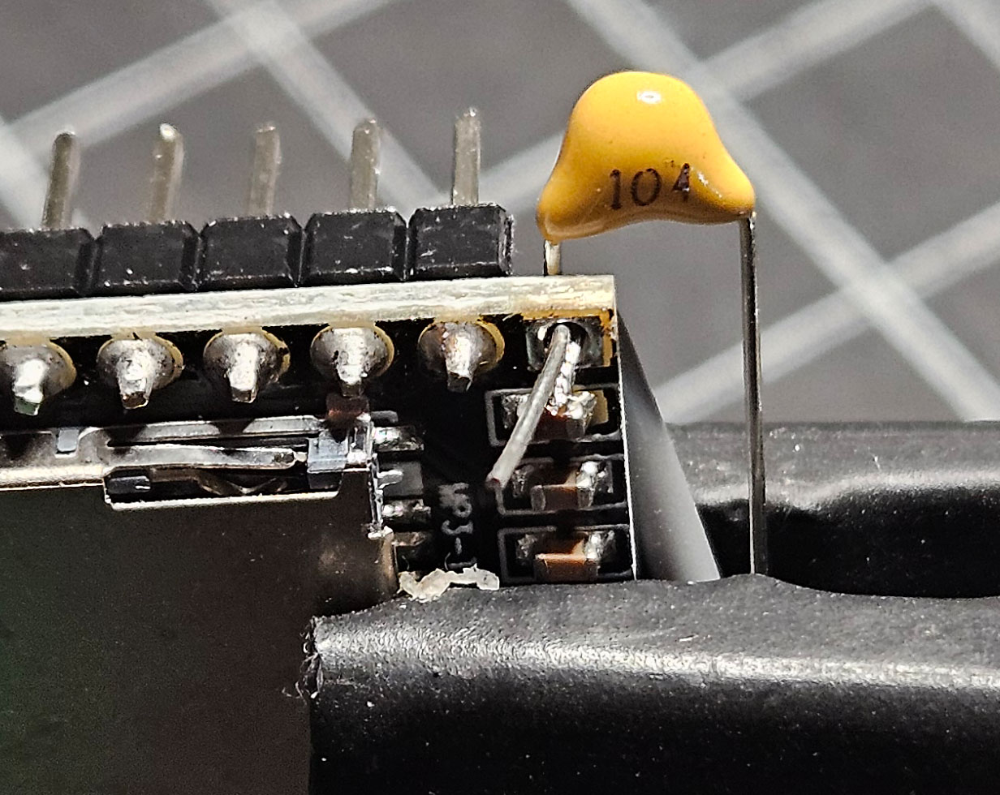
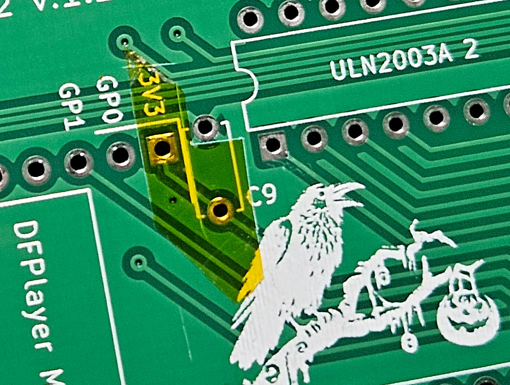
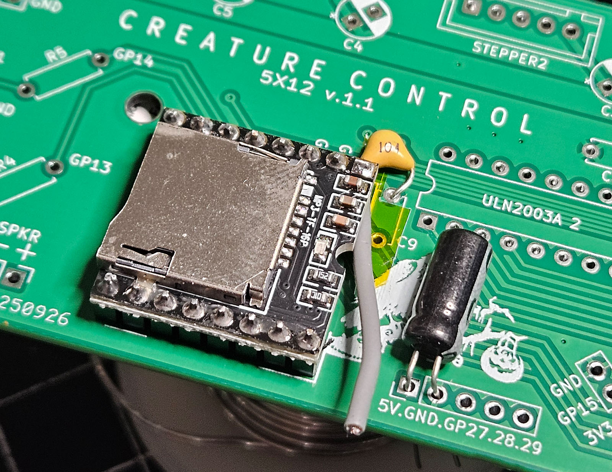
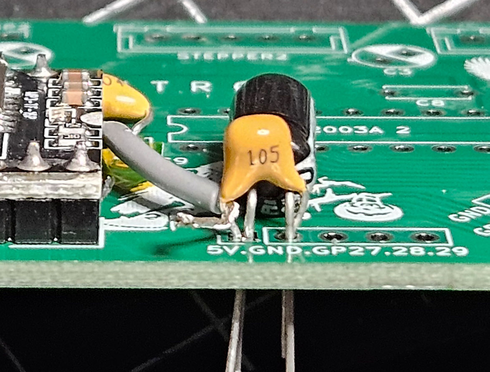

### Bodge for Max Volume PCB 1.1 ###
(You don't need this for 1.2)

|                             |                                                                                                                                                                                                                                         |
|-----------------------------|-----------------------------------------------------------------------------------------------------------------------------------------------------------------------------------------------------------------------------------------|
|  | Carefully clip the plastic above the VCC pin.                                                                                                                                                                                           |
|  | Any soldering on the DFPlayer Mini runs a high risk of disrupting the tiny SMD caps and resistors. Keep away from them and heat the pin until you can pull it out of the board and header. Clip away the rest of the plastic below VCC. |
|  | Clean up the through hole with a solder sucker (or tape, but...risky).                                                                                                                                                                  |
|  | When you're done, ensure you didn't damage the SMD components on the top or bottom of the board. The through hole should be clear.                                                                                                      |
|  | Fit a short piece of high temp wire and one leg from your 104 resistor from the bottom and solder those in place.                                                                                                                       |
|  | Add some Kapton (or electrical) tape to cover the 3v3 through hole pads.                                                                                                                                                                |
|  | Mount the DFPlayer mini carefully fitting the other leg of the 104 cap into the ground. Solder both.                                                                                                                                    |
|  | After soldering and clipping the legs you should have nothing in either 3v3 through holes.                                                                                                                                              |
|  | Bend the legs of a 220uF electrolytic and fit them into the 5V and GND holes of the nearby expansion header.                                                                                                                            |
|  | Strip the VCC wire and squeeze a 105 cap into the hole with the electrolytic in contact with the VCC wire. Solder them all into place.                                                                                                  |
|  | Completed bodge at the 5V supply.                                                                                                                                                                                                       |
|  | Completed bodge at the DFPlayer Mini.                                                                                                                                                                                                   |

Test your connections!

