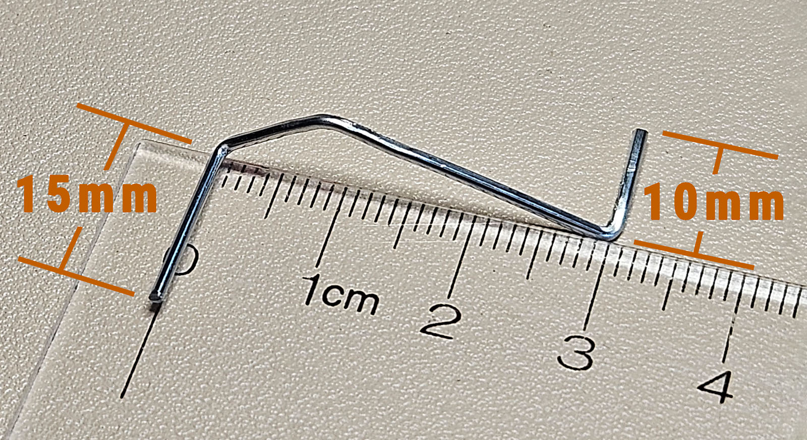

# Build Guide #
___
## Parts List: ##

### Crow ###

| Qty | Part                     | Note                                                                                                                           |
|-----|--------------------------|--------------------------------------------------------------------------------------------------------------------------------|
| 2   | 5mm Red LEDs             | For the eyes. I am using frosted.                                                                                              |
| 1   | SG90 5v Servo            |                                                                                                                                |
| 1   | 28BYJ-48 5v Stepper      | If using CC5x12 stepper control you do not need the breakout board (though you could transfer those components to the CC5x12). |
| 1   | 40mm 4Ω, 3w Speaker      | 8Ω will work.                                                                                                                  |
| 1   | Micro SD Card            | For the mp3 audio files.                                                                                                       |
| 1   | HC-SR312 AM312 Mini PIR  | Optional. Human motion sensor. *Testing the LD1020 radar sensor soon*                                                          |
| 3   | Wires/Connectors         | Two 2-wire and one 3-wire for the speaker, LEDs, and PIR. CC5X12 uses standard 2.54mm pin headers (or could be soldered directly). |
| 1   | Large Paperclip          | ~1.25mm thick.                                                                                                                 |
| 1   | 2mm Rod                  | About 15mm long for the beak hinge. I'm using carbon fiber, but any material should work.                                      |
| 9   | M3x4x5 Heat Melt Inserts | 5mm tall (M3x5x5) inserts will also fit.                                                                                       |
| 11  | M3 screws                | 5 x 8mm for the head and tail, 4 x 6mm for the stepper and PCB, 2 x 5mm countersunk for the body (or regular 6mm should work). |
| 2   | M3 nuts                  | For the stepper mount collar in the head.                                                                                      |
| 8   | 10 x 3mm magnets         | Neodymium high strength magnets for attaching tail to body.                                                                    |
|     | Hot Glue                 | Black preferred.                                                                                                               |
|     | Polyfill                 | Just a little for sound dampening in the speaker housing.                                                                      |

### [Creature Control 5x12](../creatureControl/README.md) ###
Note that the CC5x12 board will not be fully filled for this project.
CC5x12 provides multiple options for powering the 5v rail.
***You must only ever connect one of them at a time***.
The RP2040-Zero can be plugged into power (including your computer) while the 5v rail is also receiving power.

| Qty          | Part                              | Note                                                         |
|--------------|-----------------------------------|--------------------------------------------------------------|
| 1            | RP2040-Zero                       | Waveshare or equivalent.                                     |
| 1            | DFPlayer Mini                     | DFRobot or equivalent.                                       |
| 1            | 100nF 50v Ceramic Capacitor (104) | (v1.1) for DFPlayer Mini 3V3                                 |
| 1            | 1KΩ Resistor                      | (v1.1) for MCU GP0->DFPlayer Mini RX                         |
| 1            | IC DIP Socket 16-Pin              | For ULN2003A.                                                |
| 1            | ULN2003A                          |                                                              |
| 1            | XH2.54mm 5-Pin Connector          | Straight pin for stepper.                                    |
| 1            | 1N5819 Schottky Diode             | For RP2040-Zero VCC.                                         |
| 1 (optional) | 3mm LED                           | For power rail indicator.                                    |
| 1 (optional) | Resistor for above LED            | I used 2.2kΩ for a blue 3mm LED.                             |
| 1            | Resistor for Eye LEDs             | I used a 2.2kΩ for a pair of red 5mm LEDs wired in parallel. |
| 1            | 1uF 50v Ceramic Capacitor (105)   | For ULN2003A (mislabelled on v1.0 silk).                     |
| 2            | 100uF 16v Electrolytic Capacitor  | For servo and stepper.                                       |
| 1            | 1000uF 16v Electrolytic Capacitor | For 5v rail.                                                 |
| 1 (optional) | 5.5x2.1MM DC-005 Power Jack       | If using a 5v/3A adapter.                                    |
| 1 (optional) | USB-C 6-pin Surface Mount         | If using a USB battery.                                      |
| 2 (optional  | 5.1kΩ Resistors                   | If using a USB battery.                                      |
| optional     | 2.54mm Pin Headers                | If not soldering wires directly to board.                    |

___
## Head ##

|                                                                                                                          |                                                                                                                                                                                                                                                                                                                                                                                                                                                                                                                                                                                                                     |
|--------------------------------------------------------------------------------------------------------------------------|---------------------------------------------------------------------------------------------------------------------------------------------------------------------------------------------------------------------------------------------------------------------------------------------------------------------------------------------------------------------------------------------------------------------------------------------------------------------------------------------------------------------------------------------------------------------------------------------------------------------|
|                                                                              | Begin by assembling the LEDs. The resistor will be on the board, so you just wire them in parallel. I'm using a 2-wire connector from which I've cut the end and stripped the wires, plus a couple small pieces of high-temp wire and some heat shrink tubing.                                                                                                                                                                                                                                                                                                                                                      |
|                                                                     | Solder the LEDs together "stacked," putting the positive and negative leads together with the positive or negative wire. Cover all exposed wiring with heat shrink tubing or electrical tape.                                                                                                                                                                                                                                                                                                                                                                                                                       |
|                                                                              | Before assembling, test with test-servo.ino script loaded onto your CC5x12 board. Both lights should light and blink every 4 seconds.                                                                                                                                                                                                                                                                                                                                                                                                                                                                               |
|                                                                         | Carefully bend and fit both eyes into the sockets so that the cables lay nicely and run down the back inside of the head. Adjust the depth to an aesthetic level (don't push them all the way in.)                                                                                                                                                                                                                                                                                                                                                                                                                  |
|                                                                             | With everything in place, lock in the eyes and cable connections with hot glue. Leave it to cool completely with everything in place.                                                                                                                                                                                                                                                                                                                                                                                                                                                                               |
|                                                                     | I'm using a graphite 2mm rod but any 2mm material should work. Cut it just longer than the support and round over the ends. It's a little easier to press it through from the right side. Be careful not to bend the tower tabs as they are somewhat delicate.                                                                                                                                                                                                                                                                                                                                                      |
|                                                                       | Straighten a large paperclip and fold it into this shape. The ends should be 15 and 10mm and bent into as sharp a 90 as possible. The middle third of the run should have a ~45 degree bend and the two ends should be 30mm apart. See the image for the correct shape.                                                                                                                                                                                                                                                                                                                                             |
|                                                              | Bend the tip of the long (beak) leg back a little as shown and twist the spacer onto the short (servo) end. It may require a little scraping and twisting. The fit is tight, but you want it as close as possible to the 90 bend.                                                                                                                                                                                                                                                                                                                                                                                   |
|                                                               | Using pliers, work the actuator into the middle hole (of the three). This can be tricky and you may need to flex the beak a little. Use firm pressure and maintain control.                                                                                                                                                                                                                                                                                                                                                                                                                                         |
|                                                                | Once in place, it should look like this, with the actuator set against the side of the servo mount and the end of the wire tilting backwards.                                                                                                                                                                                                                                                                                                                                                                                                                                                                       |
|                                                                       | With some strong needle-nosed pliers, take that end and curl it forwards. Do your best to keep the original 90-degree bends intact. The beak end of the actuator needs to face forwards as shown.                                                                                                                                                                                                                                                                                                                                                                                                                   |
|                                                                   | Install the servo with the wires pointed down. Ensure the tip of the actuator will not catch in the hinge when the beak is fully open.                                                                                                                                                                                                                                                                                                                                                                                                                                                                              |
|                                                                        | Connect your actuator to the CC5x12. Connect power to the 5v rail and the usb to your PC. Load the test-servo.ino script (if you haven't already) and switch to the Serial Monitor. You should hear the servo reset and then start through a sequence. Watch the sequence in the monitor and disconnect the power when the servo is at the '0' position.                                                                                                                                                                                                                                                            |
|                                                                        | With the servo now at '0', hold the beak all the way open and hook the single servo arm over the actuator at the second-to-last position. While holding the beak, slide the arm over the servo with a tiny bit of slack in the connection. Don't install the screw just yet.                                                                                                                                                                                                                                                                                                                                        |
|  (YouTube video link) | Connect the servo mount plate to the head with a couple M3 screws and reconnect the CC5x12. If all has gone well, the beak will be opening and closing fully.   * If you hear the servo making a clicking or grinding sound when open, you can either loosen the bend in the actuator or adjust the servo arm connection.  * If the beak doesn't open completely you can tighten up the actuator bend or adjust the servo arm connection.  Adjust the `beakCloseDeg` and re-upload until the beak fully opens and closes without grinding noises. About 0 and 60 degrees. Small changes matter. |
|                                                     | Sand the sliding arc surface on the inside of the stepper collar smooth and lube with dry lube. Drop two M3 nuts into the slots and install two 8mm M3 screws by fitting the hex wrench through the access holes until they will just touch the stepper pin.                                                                                                                                                                                                                                                                                                                                                        |
|                                                                                        | Once everything looks good, install the screw in the servo arm and route the cables through the plates. Stack the parts and join them with two M3 8mm screws. Your crow head is ready to go.                                                                                                                                                                                                                                                                                                                                                                                                                        |

___
## Body ##
*Coming Soon*
___
## Software ##
*Coming Soon*