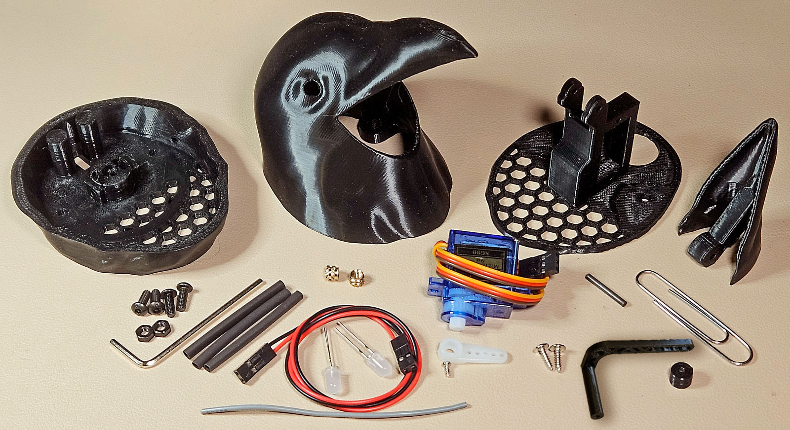

# Build Guide #
:de: [Crow Guides in German](https://github.com/padpumpkin/animatronicCrow-de)

## Parts List: ##

### Crow ###

| Qty | Part                            | Note                                                                                                                                            |
|-----|---------------------------------|-------------------------------------------------------------------------------------------------------------------------------------------------|
| 2   | 5mm Red LEDs                    | For the eyes. I am using frosted.                                                                                                               |
| 1   | SG90 5v Servo                   | MG90S also works.                                                                                                                               |
| 1   | 28BYJ-48 5v Stepper             | If using CC5x12 stepper control you do not need the breakout board (though you could transfer those components to the CC5x12).                  |
| 1   | 40mm 4Ω, 3w Speaker             | 8Ω will work. Consider a waterproof speaker if the crow will be left outdoors. A paper cone speaker is the weakest component in wet conditions. |
| 3   | M2.6 x 8mm tapping screws       | For attaching the speaker flange.
| 1   | Micro SD Card                   | For the mp3 audio files.                                                                                                                        |
| 1   | HC-SR312 AM312 Mini PIR         | Optional. Human motion (directional) sensor.                                                                                                    |
| 1   | 8006 Fresnel Lens (Black)       | Optional. Small lens replacement for the Mini PIR sensor. 
| 1   | HLK-LD1020 10G Radar Sensor     | Optional. Radar movement (non-directional) sensor.                                                                                              |
| 3   | Wires/Connectors                | Two 2-wire and one 3-wire for the speaker, LEDs, and PIR. CC5X12 uses standard 2.54mm pin headers (or could be soldered directly).              |
| 1   | Large Paperclip                 | ~1.25mm thick.                                                                                                                                  |
| 1   | 2mm Rod                         | About 15mm long for the beak hinge. I'm using carbon fiber, but any material should work.                                                       |
| 9   | M3x4x5 Heat Melt Inserts        | 5mm tall (M3x5x5) inserts will also fit.                                                                                                        |
| 11  | M3 screws                       | 5 x 8mm for the head and tail, 4 x 6mm for the stepper and PCB, 2 x 5mm countersunk for the body (or regular 6mm should work).                  |
| 2   | M3 nuts                         | For the stepper mount collar in the head.                                                                                                       |
| 8   | 10 x 3mm magnets                | Neodymium high strength magnets for attaching tail to body.                                                                                     |
|     | Cyanoacrylate (CA) and/or Epoxy | To attach the feet, magnets, and PIR window.                                                                                                    |
|     | Hot Glue                        | For sealing the speaker wire (and optionally, the speaker).                                                                                     |
|     | Polyfill                        | Just a little for sound dampening in the speaker housing.                                                                                       |

---

### [Creature Control 5x12](../creatureControl/README.md) ###
Note that the CC5x12 board will not be fully filled for this project.
CC5x12 provides multiple options for powering the 5v rail.
***You must only ever connect one of them at a time***.
The RP2040-Zero can be plugged into power (including your computer) while the 5v rail is also receiving power.

| Qty            | Part                                | Note                                                                                               |
|----------------|-------------------------------------|----------------------------------------------------------------------------------------------------|
| 1              | RP2040-Zero                         | Waveshare or equivalent.                                                                           |
| 1              | DFPlayer Mini                       | DFRobot or equivalent.                                                                             |
| 1-2 (optional) | Header sockets/pins for mounting    | Socketing the RP2040-Zero and the DFPlayer mini will enable easier replacement should either fail. |
| 3              | 100nF 50v Ceramic Capacitor (104)   | (v1.1+) for DFPlayer Mini VCC, (v1.2) input 5V, ULN2003A.                                          |
| 1              | 1µF 50v Ceramic Capacitor (105)     | (v1.2) For DFPlayer Mini midrange filter.                                                          |
| 1              | 220µF 10-16v Electrolytic Capacitor | (v1.2) For DFPlayer Mini ([or to modify prior versions](MaxVolBodge.md)).                          |
| 1              | 1KΩ Resistor                        | (v1.1+) for MCU GP0->DFPlayer Mini RX                                                              |
| 1 (optional)   | IC DIP Socket 16-Pin                | For ULN2003A. Or just solder directly to the board.                                                |
| 1              | ULN2003A                            |                                                                                                    |
| 1              | XH2.54mm 5-Pin Connector            | Straight pin for stepper.                                                                          |
| 1              | 1N5819 Schottky Diode               | For RP2040-Zero VCC.                                                                               |
| 1 (optional)   | 3mm LED                             | For power rail indicator.                                                                          |
| 1 (optional)   | Resistor for above LED              | I used 2.2kΩ for a blue 3mm LED.                                                                   |
| 1              | Resistor for Eye LEDs               | I used a 2.2kΩ for a pair of red 5mm LEDs wired in parallel.                                       |
| 1              | 1uF 50v Ceramic Capacitor (105)     | For ULN2003A (mislabelled on v1.0 silk).                                                           |
| 2              | 100uF 16v Electrolytic Capacitor    | For servo and stepper.                                                                             |
| 1              | 1000uF 16v Electrolytic Capacitor   | For 5v rail.                                                                                       |
| 1 (optional)   | 5.5x2.1MM DC-005 Power Jack         | If using a 5v/3A adapter.                                                                          |
| 1 (optional)   | USB-C 6-pin Surface Mount           | If using a USB battery.                                                                            |
| 2 (optional    | 5.1kΩ Resistors                     | If using a USB battery.                                                                            |
| optional       | 2.54mm Pin Headers                  | If not soldering wires directly to board.                                                          |

___
## Head ##

|                                                                                                                           |                                                                                                                                                                                                                                                                                                                                                                                                                        |
|---------------------------------------------------------------------------------------------------------------------------|------------------------------------------------------------------------------------------------------------------------------------------------------------------------------------------------------------------------------------------------------------------------------------------------------------------------------------------------------------------------------------------------------------------------|
|                                                                               | Begin by assembling the LEDs. The resistor will be on the board, so you just wire them in parallel. I'm using a 2-wire connector from which I've cut the end and stripped the wires, plus a couple small pieces of high-temp wire and some heat shrink tubing.                                                                                                                                                         |
|                                                                      | Solder the LEDs together "stacked," putting the positive and negative leads together with the positive or negative wire. Cover all exposed wiring with heat shrink tubing or electrical tape.                                                                                                                                                                                                                          |
|                                                                               | Before assembling, test with test-servo.ino script loaded onto your CC5x12 board. Both lights should light and blink every 4 seconds.                                                                                                                                                                                                                                                                                  |
|                                                                          | Carefully bend and fit both eyes into the sockets so that the cables lay nicely and run down the back inside of the head. Adjust the depth to an aesthetic level (don't push them all the way in.)                                                                                                                                                                                                                     |
|                                                                              | With everything in place, lock in the eyes and cable connections with hot glue. Leave it to cool completely with everything in place.                                                                                                                                                                                                                                                                                  |
|                                                                              | The actuator is made from four small parts. I recommend printing these with a 0.2mm nozzle for strength and accuracy. The metal bits are from a large (~1.25mm thick) paperclip.                                                                                                                                                                                                                                       |
|                                                                               | The hinge pin for the beak needs to be 21.5mm long (21 to 21.6mm is acceptable) and have smooth, rounded ends. If possible, use a micrometer and a small grinder (or file) to ensure the length is correct and the ends are rounded off.                                                                                                                                                                               |
|                                                                        | Bend a second ~20mm piece (also with rounded ends) into a sharp 90-degree angle. The tighter the better.                                                                                                                                                                                                                                                                                                               |
|                                                                               | The assembled actuator looks like this. The 90-degree piece should snap into place, but a touch of glue won't hurt.                                                                                                                                                                                                                                                                                                    |
|                                                         | Installing the actuator into the beak requires a firm hold since you need to flex the plastic. Start by putting the long (left) side into the hole as shown.                                                                                                                                                                                                                                                           |
|                                                | While simultaneously pushing down with the actuator and flexing the right side of the beak up (away) pivot the pin into the second hole.                                                                                                                                                                                                                                                                               |
|                                                                      | I'm using a graphite 2mm rod but any 2mm material should work. Cut it just longer than the support and round over the ends. It's a little easier to press it through from the right side. Be careful not to bend the tower tabs as they are somewhat delicate.                                                                                                                                                         |
|                                                        | The assembled beak, servo plate, and actuator should move freely. Add (dry) lubricant to the beak hinge pins and the surface on the side of the mount where the actuator will slide. Note that the actuator will not hit the beak hinge pin.                                                                                                                                                                           |
|                                                                         | Connect your actuator to the CC5x12. Connect power to the 5v rail and the usb to your PC. Compile and upoad the [test-servo](ino/test-servo) script to your CC5x12 and select the the Serial Monitor. You should hear the servo reset and then start through a sequence. Watch the sequence in the monitor and disconnect the power when the servo is at the '0' position.                                             |
|                                                              | Install the servo with the wires towards the plate. Attach it with the two provided screws. Hold the beak all the way down, place the spacer on the actuator pin and and hook the single servo arm over it at the second-to-last hole. Slide the arm onto the servo gears as low as it will go without hitting the plate or putting the gears under tension. Install the screw.                                        |
|  (YouTube video link)  | Connect the servo mount plate to the head with M3 screws and reconnect the CC5x12. The beak should be opening and closing.  <b>Calibrate:</b> • Adjust <code>SERVO_PWM_MIN/MAX</code> to stop grinding at extremes (reduce or expand range). • Use <code>BEAK_OPEN/CLOSED_DEG</code> (0 to 180) to set travel range. • Change in small increments; if it hums, back off values to prevent burnout. |
|                                                     | Consider adding a thread locker to the stepper collar mounting screws. Clean the screws and nuts with isopropyl alcohol to remove oil and add a small amount of a removable thread locker to the threads.                                                                                                                                                                                                              |
|                                                      | Sand the sliding arc surface on the inside of the stepper collar smooth and lube with dry lube. Drop two M3 nuts into the slots and install two 8mm M3 screws by fitting the hex wrench through the access holes until they will just touch the stepper pin.                                                                                                                                                           |
|                                                                                         | Once everything looks good, route the cables through the plates. Stack the parts and join them with two M3 8mm screws. Your crow head is ready to go.                                                                                                                                                                                                                                                                  |

___
## Body ##

|                                                                      |                                                                                                                                                                                                                                                                                                                              |
|----------------------------------------------------------------------|------------------------------------------------------------------------------------------------------------------------------------------------------------------------------------------------------------------------------------------------------------------------------------------------------------------------------|
|                | Install seven heat melt inserts. Two for the stepper plate, two for the stepper, two for the PCB, and one for the tail tab.                                                                                                                                                                                                  |
|                            | Glue on the feet. I used 2-ton epoxy with a slower cure time. Coat the feet sockets and pegs and after installing them stand the crow upright on a flat surface and adjust the feet slightly with a little downward pressure on the body before leaving them to set.                                                         |
|                         | Remove supports and scrape the magnet recesses clear. Glue magnets using epoxy or CA while paying close attention to polarity.                                                                                                                                                                                               |
|                     | The tail tab is designed to snap into place. You might need to press hard until it clicks.                                                                                                                                                                                                                                   |
|                          | With the tab installed, the tail is ready to go.                                                                                                                                                                                                                                                                             |
|                         | Attach the lead to the speaker. I clipped the end of a standard 2-pin connector and soldered the ends directly to the speaker. Once glued in place there shouldn't be any strain on the wires.                                                                                                                               |
|      | Prepare the speaker by feeding the connector through the guide ring on the side of the speaker box. Note the loose polyfill in the speaker box. This is intended to reduce noise, but might be best left out if the model will be outside in wet conditions. Seal the wires into the slot using hot glue or another sealant. |
|      | After placing the speaker into the fitting, top up the glue or sealant around the wires to prevent a sound leak.                                                                                                                                                                                                             |
|        | Install the speaker flange with 2.6mm x 8mm tapping screws. Alternatively, glue the speaker into the housing.                                                                                                                                                                                                                |
|         | The crow's head rotates on the two pegs that stick out just to the sides at the bottom of the stepper mount. I am sanding these (and the sweeping arc on the stepper collar that mounts to the head) to 800 grit and coating them with dry PTFE lubricant.                                                                   |
|              | Install the stepper with two M3x6 screws. I am using two M3x5 countersunk screws to attach the plate to the body, but regular M3x6 screws should work as well.                                                                                                                                                               |
|     | Routing the stepper connection requires some very long needle-nosed pliers. Bend the wires sideways and slip the connector and wires through the same ring you put the speaker wires through.                                                                                                                                |
|                    | Attach the stepper plate to the crow body using M3 screws.                                                                                                                                                                                                                                                                   |
|                   | **1a: PIR Sensor with Black Fresnel (my preferred)**  *The sensor is optional* The small, black fresnel lens (8006) is an upgrade to the mini-PIR sensor. The holder is printed in two pieces and will need to be glued together (heat can damage the PIR sensor) and glued into the body.                              |
|                   | **1b: PIR Sensor with Black Fresnel (my preferred)**  Prepare by replacing the lens (clean the sensor and ensure the inside of the fresnel lens is clear), inserting it into the leg plug, and gluing on the rear cap. I also place a little hot glue on the 3-pin connector just to ensure it doesn't pull off during assembly. |
|                   | **1c: PIR Sensor with Black Fresnel (my preferred)**  Take care gluing the plug into the knee. I prefer epoxy for this, but either glue needs to be managed with care to prevent damage to the finish.                                                                                                               |
|                      | **2a: PIR Sensor with Standard Fresnel**  *The sensor is optional* It's better to print the PIR sensor mount face-down with a 0.2mm nozzle.  There is not much room for the wires, so either install the header vertically or bend it like I have (a risky maneuver). Add some hot glue to ensure things don't shake loose. |
|                    | **3a: Radar Sensor**  *The sensor is optional* It's better to print the radar sensor mount face-down with a 0.2mm nozzle.  There is not much room for the wires, so I've used a 90-degree pin header. Add some hot glue to ensure things don't shake loose.                                              |
|                          | **2b & 3B PIR: Sensor with Standard Fresnel *or* Radar Sensor:** Installing the sensor is fiddly and requires slightly flexing the holder. Practice ahead of time with the empty holder. To remove the holder, grab the little column (green arrow here) with a pair of pliers and lift it upwards.                          |
|                 | **4a: "Try Me" Button**  *Optional* To utilize the pushbutton feature, attach a two-pin button (either NO or NC) to the SNSR1 GND and GP15 pins (connect nothing to the 3V3 pin). Route the wire out through the hole behind the left leg or tail.                                                               |
|                             | Install the head on the stepper and use a piece of card stock to "shim" the top edge (green arrow). Using a 2mm hex wrench through the access holes on either side, tighten each while alternating: first just snug each, then tighten firmly.                                                                               |
|                               | At this point you should have all the wires hanging out the back of the body.                                                                                                                                                                                                                                                |
|          | Attach the mounting rail to the PCB with M3x6 screws. Clip any long leads that stick through the PCB under or near the mounting rail.  *Copy MP3 files to the SD card, as it will require disconnecting the PCB to get to it later.*                                                                                 |
|                         | Flip the crow over onto its back. Set it on a t-shirt or soft cloth to prevent scratches.                                                                                                                                                                                                                                    |
|  | Connect the LED, speaker, and servo leads. Pay attention to polarity (servo brown is GND).                                                                                                                                                                                                                                   |
|                   | Slide the board partway into the body and connect the stepper and sensor.                                                                                                                                                                                                                                                    |
|        | Slide the board the rest of the way in until it stops and the rail clicks into place.                                                                                                                                                                                                                                        |
|                             | Flip over the crow. Route any external connections through the hole in the tail and attach it to the back of the crow.                                                                                                                                                                                                       |
|         | You can secure the tail to the body with a M3x8 screw through the hole located between the wings just in front of the tail.                                                                                                                                                                                                  |
|                              | In lieu of a cable, you can carefully set a battery into the body of the crow (taking care not to damage or short any components) for a self-contained model.                                                                                                                                                                |

___
## Software ##
Copy the [mp3](mp3) folder to your SD card.

Install the [Arduino IDE](https://www.arduino.cc/en/software/) and the following libraries:
[AccelStepper](https://www.airspayce.com/mikem/arduino/AccelStepper),
[DFRobotDFPlayerMini](https://github.com/DFRobot/DFRobotDFPlayerMini),
[arduino-pico](https://github.com/earlephilhower/arduino-pico) by Earle Philhower,
[Adafruit NeoPixel](https://github.com/adafruit/Adafruit_NeoPixel). 
All of these should be installable from the library manager once in the Arduino IDE.

Enable the *Waveshare RP2040-Zero* board in the board manager.

Connect your RP2040-Zero to your PC, select the connected device, and assign the Waveshare RP2040-Zero board. 
Open the desired sketch and select 'Upload.'

### Sketches ###
*Note that Arduino expects the animations.h file to be in the same folder as the animatrnoic-crow or test-animations sketches.*
* [animatronic-crow](ino/animatronic-cros): The main software for your bird. You'll need to know the volume, stepper speed, and beak closed degrees so you can configure this for your particular crow. When connected to a PC, debug messages are sent to the Arduino Serial Monitor.
  * __TEST_MODE__ when set to true will illuminate the eyes whenever the sensor senses movement. Helpful for adjusting timeouts.
  * __SENSOR_MODE__ set to one of the following values:
    * __SENSOR_MODE_PIR__ will scold when it detects motion.
    * __SENSOR_MODE_LD1020__ will scold when it detects motion but block the sensor from detecting the crow's idle movements and squawks.
    * __SENSOR_MODE_BUTTON__ enables a "Try Me" pushbutton feature. The crow will wake up, scold, turn its head, squawk, and go back to sleep whenever the button is pressed. Button presses while the sequence is running will have no effect.
    * __SENSOR_MODE_NONE__ with no sensor, or when you prefer the full set of random scold and squawk animations.
  * __DFPLAYER_VOLUME__ hypothetical max 30, but actual max depends on power supply, speaker, etc. It's best to test (with test-animations and on battery power if that's how you intend to use it) and if sound drops out, lower until it doesn't.
  * __LD1020_ANIMATION_COOLDOWN_MS__ is your main "how reactive do I want this crow to be?" setting when using radar.
  * __SCOLD_SQUAWK_BLOCK_MS__ is your main "how reactive do I want this crow to be?" setting when using PIR.
  * __IDLE*__ settings control how active a non-reacting crow will be.
  * __BLINK*__ controls frequency of blinking.
  * __NECK*__ don't change the range, but adjust the fast speed if needed after testing with test-stepper.
  * __PIN__ definitions change if you aren't using the CC5x12 sensor1, servo1, stepper1, or led1.
* [test-animations](ino/test-animations): Confirm sound, test volume, and review animations. Play scolds and squawks and set volume on the Arduino Serial Monitor.
* [test-sensor](ino/tes-sensor): Simple sketch that illuminates the eyes when the sensor senses. Helps one understand/visualize sensor sensitivity.
* [test-servo](ino/test-servo): Reset the servo to zero->half->full->zero->etc. every four seconds. Necessary for determining the beak closed setting. Details on the serial monitor. Eyes blink for each movement.
* [test-stepper](ino/test-stepper): Runs through various tests to help you determine the max speed and acceleration for your stepper (neck). Details on the Serial Monitor.

