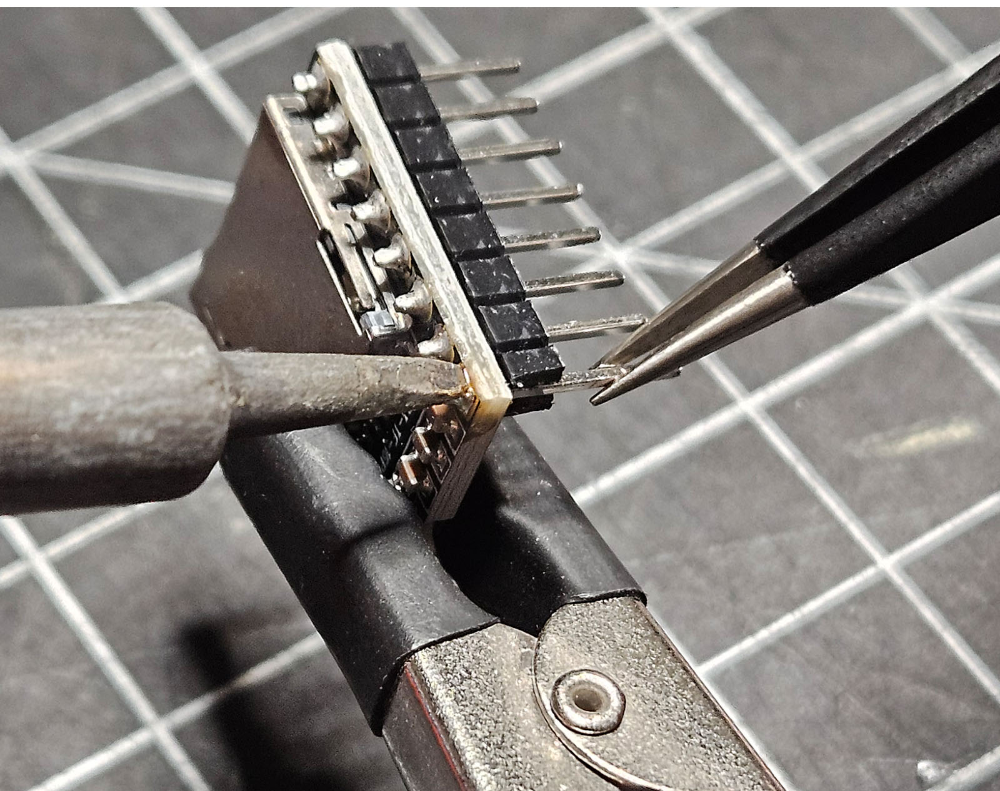

### Bodge for Max Volume PCB 1.0 & 1.1 ###
(You don't need this for v1.2+ boards)

| Step | Simple Bodge v1.0 or v1.1    | This is my go-to for both v1.0 and v1.1 since I don't hear any noise or buzzing through the tiny 3-watt speaker without the ceramic caps.                                                                                          |
|---|------------------------------|------------------------------------------------------------------------------------------------------------------------------------------------------------------------------------------------------------------------------------|
| 1 |   | Carefully clip the plastic above the VCC pin on the DFPlayer Mini.                                                                                                                                                                 |
| 2 |   | Any soldering on the DFPlayer Mini runs a risk of disrupting the tiny SMD caps and resistors. Keep away from them and heat the pin until you can pull it out of the board and header. Clip away the rest of the plastic below VCC. |
| 3 |   | Clean up the through hole with a solder sucker (or tape, but...risky).                                                                                                                                                             |
| 4 |   | When you're done, ensure you didn't move or detatch any SMD components on the top or bottom of the board. The through hole should be clear.                                                                                        |
| 5 |   | Cover the 3V3 through-hole pad with a bit of Kapton or electrical tape.                                                                                                                                                            |
| 6 |   | Strip the ends off a ~25mm length of high-temperature wire. Twist and solder one end through the DFPlayer Mini from below. Solder the DFPlayer Mini to the CC5x12 board.                                                           |
| 7 |   | Bend the other end of the wire through the 5V expansion header hole. Fit a 220uF electrolytic capacitor through the same 5V and adjacent GND holes. Solder in place.                                                               |
| 8 |   | The completed bodge will support max volume (30) from the internal 3W amplifier of the DFPlayer Mini.                                                                                                                              |

| Step | Bodge v1.1 with Ceramic Caps | Ceramic capacitors will reduce board noise.                                                                                            |
|------|------------------------------|----------------------------------------------------------------------------------------------------------------------------------------|
| 1-4  | Same as above.               |                                                                                                                                        |
| 5    |   | Fit a short piece of high temp wire and one leg from your 104 resistor from the bottom and solder those in place.                      |
| 6    |   | Add some Kapton (or electrical) tape to cover the 3v3 through hole pads.                                                               |
| 7    |   | Mount the DFPlayer mini carefully fitting the other leg of the 104 cap into the ground. Solder both.                                   |
| 8    |   | After soldering and clipping the legs you should have nothing in either 3v3 through holes.                                             |
| 9    |   | Bend the legs of a 220uF electrolytic and fit them into the 5V and GND holes of the nearby expansion header.                           |
| 10   |   | Strip the VCC wire and squeeze a 105 cap into the hole with the electrolytic in contact with the VCC wire. Solder them all into place. |
| 11   |   | Completed bodge at the 5V supply.                                                                                                      |
| 12   |   | Completed bodge at the DFPlayer Mini.                                                                                                  |

Test your connections!

