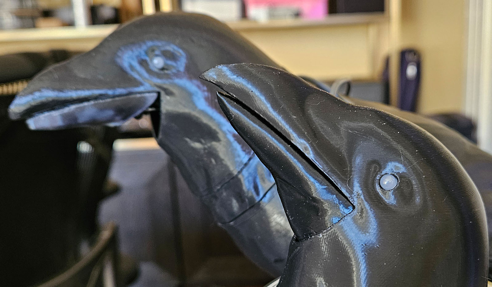

# Animatronic Crow
Based on  designs from Thingiverse:
[Animatronic Halloween Crow by andymcculloch](https://www.thingiverse.com/thing:6278223)
and [Animatronic Halloween Crow by Doctor_JohnSmith](https://www.thingiverse.com/thing:6258153)
which are themselves remixes from [danman](https://www.thingiverse.com/danman/designs)
who remixed the original model by [YahooJAPAN](https://www.thingiverse.com/yahoojapan/designs).

My work has been done in [KiCad](https://www.kicad.org/),
[FreeCAD](https://www.freecad.org/),
and [Blender](https://www.blender.org/download/releases/4-4/).
___
## [Crow Printing Instructions](stl/README.md)
___
## [Crow Build Guide](BUILD.md) ##
___

### Modifications and model sources: ###

| Model                             | Source           | Modifications                                                                                                                                                                                                                        |
|-----------------------------------|------------------|--------------------------------------------------------------------------------------------------------------------------------------------------------------------------------------------------------------------------------------|
| Global                            |                  | Standardized on M3 x 4 or 5 x 5 heat set inserts for M3 fasteners.                                                                                                                                                                   |
| Head                              | andymcculloch    | Refined beak shape to add more of a point. Smoothed/bevelled lower beak opening. Cut away mounts and rebuilt them slightly wider and short enough to fit below the SG90 servo.                                                       |
| Beak                              | Doctor_Johnsmith | Added a lower collar that fits inside the head without a visible cut-away. Re-drew mounting rail. Sliced to enable 3D printing standing up.                                                                                          |
| Beak Servo Mount Plate            | andymcculloch    | Refined connector tower to accommodate the larger beak. Straightened out SG-90 mount and shrunk mounting holes to match the screws that come with SG90 servos. Added hexagonal grille for sound. Moved M3 screw holes.               |
| Head Stepper Collar               | andymcculloch    | Moved stepper center. Shrunk cable opening and added alignment pins. Added hexagonal grille for sound. Moved M3 screw holes.                                                                                                         |
| Body Stepper Mount Plate          | Andymcculloch    | Moved stepper center. Added arched cutout for alignment pins. Added head stepper collar support pins. Added hexagonal grille for sound. Enlarged head holes to accommodate M3 screws.                                                |
| Body *(in progress, will change)* | Doctor_Johnsmith | Cut away servo mount plate and added mounts for andymcculloch stepper mount plate. Added enclosed box for 40mm speaker. Added mount rail for Creature Control 5x12 PCB. Enclosed 9x2mm magnet mounts. Added alignment tabs for feet. |
| Feet *(in progress, will change)* | Doctor_Johnsmith | Added alignment tabs.                                                                                                                                                                                                                |
| Tail *(in progress, will change)* | Doctor_Johnsmith | Enclosed 9x2mm magnet mounts. Enlarged hole for exterior connection.                                                                                                                                                                 |

### Additions: ###

| Model           | Description                                                                                    |
|-----------------|------------------------------------------------------------------------------------------------|
| Actuator Spacer | Fits between the SG90 and the 90-degree bend in the control wire.                              |
| PCB Mount       | Small rail to mount the Creature Control 5x12 board with M3 hardware to slide inside the body. |
