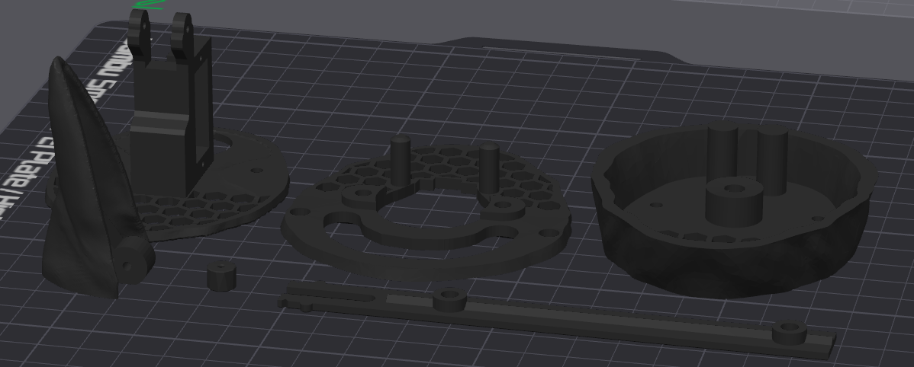

# 3D Printable STL Files #
One of each required for a crow. 
Print in the orientation shown in the images below. 
Consider PETG for a more weather resistant material, but note that the model is not designed to be waterproof.

