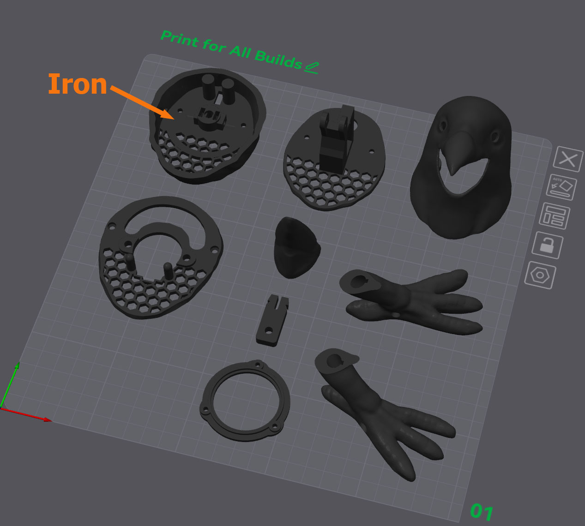
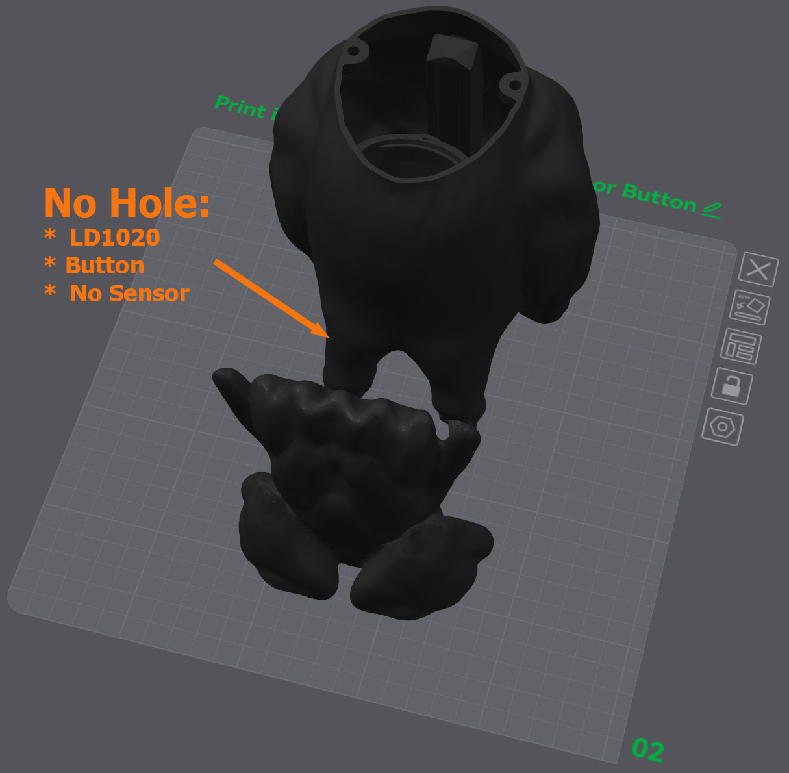
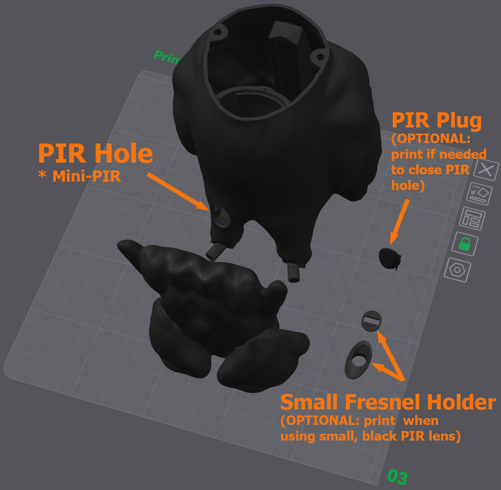
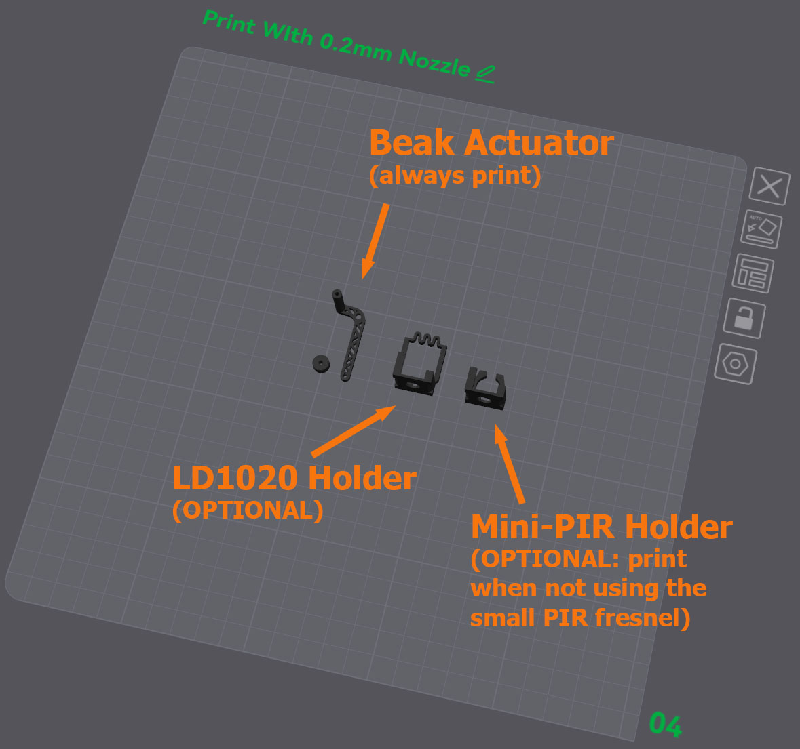

# 3D Printing #
:de: [Crow Guides in German](https://github.com/padpumpkin/animatronicCrow-de)

Print in the orientation shown in the images below. 
Consider PETG for a more weather resistant material, but note that the model is not fully weatherproof.

## Note: ##
The crow body is designed to be printed with minimal supports (only for the "ankles").
If your slicer wants to generate an enormous support to catch the tiny top of the PCB mount you should mark it "do not support" and save some filament.

On a related note, I do prefer to support the sloping underside of the beak. 
The [.3mf](https://makerworld.com/en/models/1869791-animatronic-halloween-crow) includes these settings.

## Second Note: ##
The stepper collar slides against the stepper plate.
I print the collar with ironing on to help smooth the surface.
After printing, I sand both the dome mounts on the body plate and the sliding surface on the collar to 800 grit.
Add dry lube to both before assembly.

# Printing #
I find that PETG printed with a 0.4mm nozzle and 0.16mm layer height provides a strong build and a shiny appearance like bird feathers at the expense of a long print.

|                                                                 |                                                                                                     |
|-----------------------------------------------------------------|-------------------------------------------------------------------------------------------------------------------------------------------------------------------------------------------------------------------------------------------------------------------------------------|
|  | Print all parts on the first plate for all builds. Turn on ironing for the top of the collar. Consider the seam on the lower portion of the head (I like to align it right down the middle). The speaker ring and tail screw tab are optional, though I recommend both.             |
|  | The crow body with no hole is used for non-PIR builds.                                                                                                                                                                                                                              |
|  | The body with the PIR hole can be used for a regular, white-lens Mini-PIR or with a replacement small black lens. You need the Small Fresnel Holder *or* the Mini-PIR Holder&mdash;not both. The PIR Plug can be used to close the PIR Hole if you decide to use another/no sensor. |
|  | The actuator, spacer, and sensor holders are best printed with a 0.2mm nozzle and a "strength" setting (I prefer 0.10mm layer height).                                                                                                                                              |

