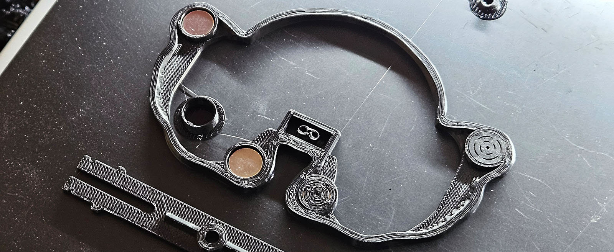
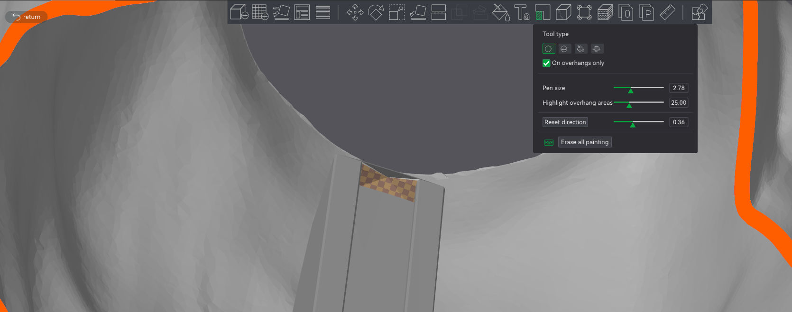
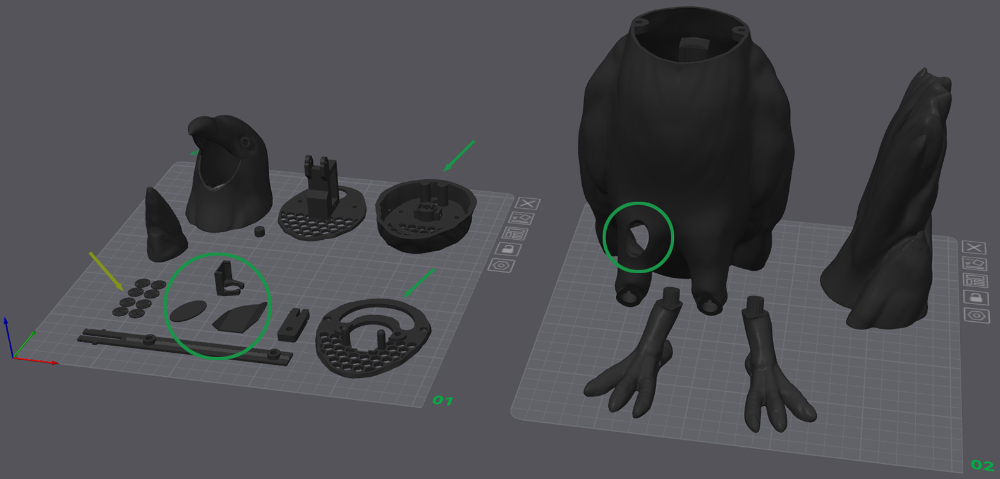
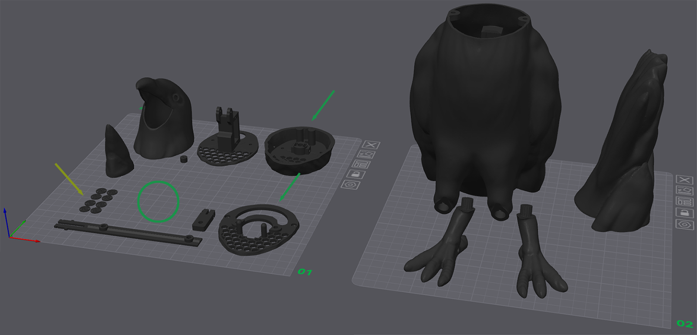

# 3D Printing #
:de: [Crow Guides in German](https://github.com/padpumpkin/animatronicCrow-de)

Print in the orientation shown in the images below. 
Consider PETG for a more weather resistant material, but note that the model is not designed to be weatherproof.

### Needed for Printing ###

| Qty | Part                   | Note                        |
|-----|------------------------|-----------------------------|
| 8   | 10x3 Neodymium Magnets | For the tail-to-body mount. |
|     | Cyanoacrylic Glue      | For the magnet shims.       |

## Important Note: ##
The magnet mount holes are sealed and will require you to pause during printing to install them.
The spaces are 3.5mm tall, so for example, at a 0.16mm layer height, I have to pause on layer 25.

*Measure your magnets.*
Mine are 2.66mm tall, so taking that away from 3.5mm and leaving a little slack, I scale the Z axis of the 1.0mm shims (yellow arrows below) to 80%.

Magnets must be installed with the correct polarity!
Mark the Tail and Body sides so you don't get confused.
I add a touch of CA glue to the shim and stick one onto each magnet before resuming the print.

## Second Note: ##
The crow body is designed to be printed with minimal supports (only for the "ankles").
My slicer (Bambu) wants to generate an enormous support to catch the tiny top of the PCB mount.
I highlight it "do not support" and save some filament.

On a related note, I do need to support the sloping underside of the beak. YMMV.

## Third Note: ##
The stepper collar slides against the stepper plate.
I print these two pieces (green arrows below) with ironing on to help smooth the surface.
After printing, I sand both the dome mounts on the body plate and the sliding surface on the collar to 800 grit.
Add dry lube to both before assembly.

# Crow with PIR Sensor Window #

### PIR Components in Green Circles ###
* *Not Pictured:* The beak actuator.  *(Recommend printing with 0.2mm nozzle.)*
* A holder for the PIR sensor. *(Recommend printing with 0.2mm nozzle.)*
* An internal cover (to prevent the sensor from seeing the crow move its head from the inside).
* Crow body with PIR window cutout.
* An oval for covering the PIR window.
* Feet with or without holes will work--the holes are for a zip tie or wire attachment.

# Crow with No Sensor or Radar Sensor #

* *Not Pictured:* The beak actuator.  *(Recommend printing with 0.2mm nozzle.)*
* *Not Pictured:* A radar mount belongs in the green circle (will update once I have the LD1020 in hand).
* Crow body with NO window cutout.
* Feet with or without holes will work--the holes are for a zip tie or wire attachment.

