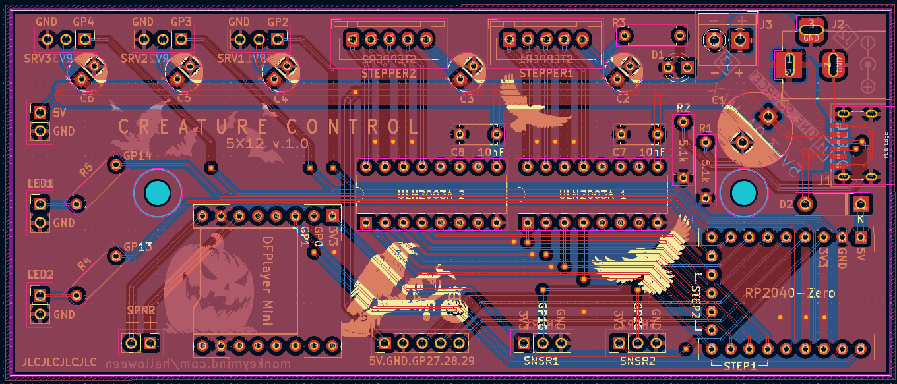
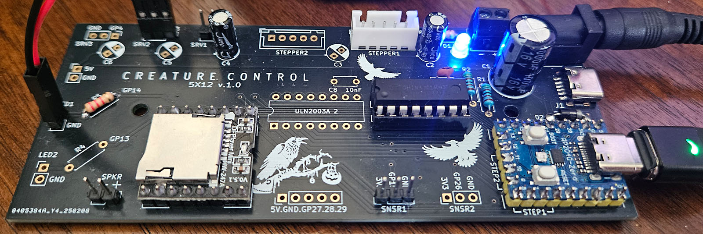

# Creature Control PCB #
When hand soldering a board to enable the animatronic crow I realized that I wanted a half-dozen crows and maybe some talking skulls and hand soldering wasn't my favorite way to spend my time.
Hence Creature Control 5x12. Designed to enable a bunch of capability using an inexpensive and easy to program Raspberry Pi 2040 in the tiny Waveshare Zero format.

## 5x12 v1.0 ##
Provides a 5-volt 3-amp power rail to supply 3 servos and 2 steppers controlled by a RP2040-Zero which is also wired to incorporate 2 LEDs, 2 motion sensors, the DFPlayer Mini mp3 player and a pin header for the remaining pins.
Easily programmable using Arduino libraries.

*Gerber files have been produced for JLCPCB but may work elsewhere.*

### VITAL IMPORTANT SAFETY NOTICE! ###
*The 5 volt power rail allows for multiple source connections but only one should be used at any given time.* 
*Do not connect more than one 5 volt source to the power rail!*
(Unless you really know what you're doing.)
It is safe to connect the power rail and the RP2040-Zero to your PC at the same time--in fact it's necessary for testing.
### Parts List ###
The intent is that one would install only the components needed for a project.

| Qty          | Part                                                           | Note                                                                                                     |
|--------------|----------------------------------------------------------------|----------------------------------------------------------------------------------------------------------|
| 1            | RP2040-Zero                                                    | Waveshare or equivalent.                                                                                 |
| 1            | 1N5819 Schottky Diode                                          | For RP2040-Zero VCC.                                                                                     |
| 1            | DFPlayer Mini                                                  | DFRobot or equivalent.                                                                                   |
| 1-2          | ULN2003A                                                       | Stepper driver.                                                                                          |
| 1-2          | IC DIP Socket 16-Pin                                           | For ULN2003A.                                                                                            |
| 1-2          | XH2.54mm 5-Pin Connector                                       | Straight pin for stepper.                                                                                |
| 1-2          | 10nF 50v Ceramic Capacitor                                     | For ULN2003A.                                                                                            |
| 1 (optional) | 3mm LED                                                        | For power rail indicator.                                                                                |
| 1 (optional) | Resistor for power indicator LED                               | I used 2.2kΩ for a blue 3mm LED.                                                                         |
| 1-2          | Resistor for external LEDs                                     | Based on LED(s) to be used.                                                                              |
| 1-5          | 100uF 16v Electrolytic Capacitor                               | One for each servo and stepper.                                                                          |
| 1            | 1000uF 16v Electrolytic Capacitor                              | For 5v rail.                                                                                             |
| 1 (optional) | 5.5x2.1MM DC-005 Power Jack                                    | If using a 5v/3A adapter.                                                                                |
| 1 (optional) | USB-C 6-pin Surface Mount                                      | If using a USB battery.                                                                                  |
| 2 (optional) | 5.1kΩ Resistors                                                | If using a USB battery.                                                                                  |
| 1 (optional) | KF350-2P 3.5mm Pitch 2Pin PCB Screw Terminal Block Connector   | If using a wired 5v source or drain. Also useful if needing to share ground with an external power rail. |
| optional     | 2.54mm Pin Headers                                             | For board connections.                                                                                   |
