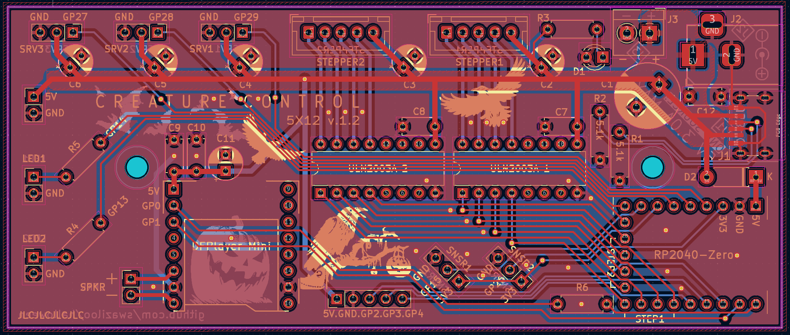
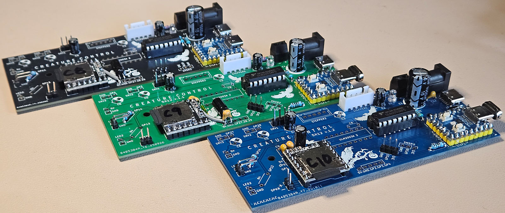

# Creature Control PCB #
When hand soldering a board to enable the animatronic crow I realized that I wanted a half-dozen crows and maybe some talking skulls and hand soldering wasn't my favorite way to spend my time.
Hence Creature Control 5x12. Designed to enable a bunch of capability using an inexpensive and easy to program Raspberry Pi 2040 in the tiny Waveshare Zero format.

*I likely have extra PCBs&mdash;contact me directly if interested in PCB(s) at cost.*

## 5x12 v1.0 ##
Provides a 5-volt 3-amp power rail to supply 3 servos and 2 steppers controlled by a RP2040-Zero which is also wired to incorporate 2 LEDs, 2 motion sensors, the DFPlayer Mini mp3 player and a pin header for the remaining pins.
Designed to be hand-soldered and easily programmable using Arduino libraries.
### v1.1 2025-09 ###
Larger PTH (0.9mm) for MCU and mp3 player mounts, 
add 1KΩ serial resistor for DFPlayer RX (MCU GP0) connection, 
add capacitor (104) for DFPlayer 3V3, 
remove incorrect silk for C7 and C8 value,
rotate sensor mounts for better routing,
update schema.
### v1.2 2025-10 ###
Move DFPlayer Mini to 5V supply and add additional bulk/filtering capacitors (1µF, 220µF),
add filtering capacitor (0.1µF) at 5V power supply,
move servos 1-3 to GP27-GP29,
move GP2-GP4 to expansion header,
rotate DFPlayer Mini,
(re)arrange silks,
update schema.

*Gerber files have been produced for JLCPCB but may work elsewhere.*

### VITAL IMPORTANT SAFETY NOTICE! ###
*The 5 volt power rail allows for multiple source connections but only one should be used at any given time.* 
*Do not connect more than one 5 volt source to the power rail!*
(Unless you really know what you're doing.)
It is safe to connect the power to the 5v rail and the RP2040-Zero to your PC at the same time&mdash;in fact it's necessary for testing.
### Parts List ###
The intent is that one would install only the components needed for a project.

| Qty            | Ref        | Part                                                         | Note                                                                                                     |
|----------------|------------|--------------------------------------------------------------|----------------------------------------------------------------------------------------------------------|
| 1              |            | RP2040-Zero                                                  | Waveshare or equivalent.                                                                                 |
| 1              | D2         | 1N5819 Schottky Diode                                        | For RP2040-Zero VCC.                                                                                     |
| 1              |            | DFPlayer Mini                                                | DFRobot or equivalent.                                                                                   |
| 3-4            | C7-C9, C12 | 100nF 50v Ceramic Capacitor (104)                            | (v1.1+) for DFPlayer Mini 5V, (v1.2) input 5V, ULN2003A.                                                 |
| 1              | C10        | 1µF 50v Ceramic Capacitor (105)                              | (v1.2) For DFPlayer Mini midrange filter.                                                                |
| 1              | C11        | 220µF 10-16v Electrolytic Capacitor                          | (v1.2) For DFPlayer Mini .                                                                               |
| 1              | R6         | 1KΩ Resistor                                                 | (v1.1+) for MCU GP0->DFPlayer Mini RX                                                                    |
| 1-2            |            | ULN2003A                                                     | Stepper driver.                                                                                          |
| 1-2 (optional) |            | IC DIP Socket 16-Pin                                         | For ULN2003A. Or just solder directly to the board.                                                      |
| 1-2            |            | XH2.54mm 5-Pin Connector                                     | Straight pin for stepper.                                                                                |
| 1 (optional)   | D1         | 3mm LED                                                      | For power rail indicator.                                                                                |
| 1 (optional)   | R3         | Resistor for power indicator LED                             | I used 2.2kΩ for a blue 3mm LED.                                                                         |
| 1-2            | R4,R5      | Resistor for external LEDs                                   | Based on LED(s) to be used.                                                                              |
| 1-5            | C2-C6      | 100µF 10-16v Electrolytic Capacitor                          | One for each 5v servo and stepper.                                                                       |
| 1              | C1         | 1000µF 10-16v Electrolytic Capacitor                         | For 5v rail.                                                                                             |
| 1 (optional)   | J2         | 5.5x2.1MM DC-005 Power Jack                                  | If using a 5v/3A adapter.                                                                                |
| 1 (optional)   | J1         | USB-C 6-pin Surface Mount                                    | If using a USB battery.                                                                                  |
| 2 (optional)   | R1,R2      | 5.1kΩ Resistors                                              | If using a USB battery.                                                                                  |
| 1 (optional)   | J3         | KF350-2P 3.5mm Pitch 2Pin PCB Screw Terminal Block Connector | If using a wired 5v source or drain. Also useful if needing to share ground with an external power rail. |
| optional       |            | 2.54mm Pin Headers                                           | For board connections.                                                                                   |

## Building the CC5x12 ##

* You do not need to fill the board. It is perfectly acceptable to install only the connections and components you intend to use.
* If you are installing the USB-C socket, do that first and test the electrical connections. Every other component is easier to hand solder.
* The RP2040-Zero can be powered by its USB-C connection or the board 5v power, but it will not provide power to the steppers, servos, or DFPlayer (since v1.2). LEDs and sensors draw power from the RP2040-Zero 3V3.
* The C1 capacitor is intended to smooth out the 5v supply for the board. C2-C6 & C11 provide demand power for their nearby stepper, servo, or DFPlayer Mini. Only install these caps for the components you intend to connect.
___

## Testing ##
Install the Arduino IDE and the following libraries:
[AccelStepper](https://www.airspayce.com/mikem/arduino/AccelStepper),
[DFRobotDFPlayerMini](https://github.com/DFRobot/DFRobotDFPlayerMini),
[arduino-pico](https://github.com/earlephilhower/arduino-pico) by Earle Philhower,
[Adafruit NeoPixel](https://github.com/adafruit/Adafruit_NeoPixel).
Install using the library manager in the Arduino IDE.

* Enable the *Waveshare RP2040-Zero* board in the board manager.
* Connect power to one of the 5v inputs and the RP2040-Zero to your pc. 
* Select the connected device/port and ensure the Waveshare RP2040-Zero board is assigned.
* Open the [BoardTest](BoardTest) sketch with the Arduino IDE.
* Set 'true' for available components at the top of the sketch. 
* Select the 'Upload' button.
* The sketch should compile, the board should initialize, and a test loop should run.

The steppers, servos, and MP3 components will cycle.
The LED(s) will reflect the sensor(s) states.

___
## Notes and Issues: ##

### Volume Issues v1.0 and v1.1 ###
The DFPlayer Mini is being powered off the RP2040-Zero 3V3 on these boards which doesn't provide enough power to handle max draw at high volume.
The fix for these boards is to pull the VCC pin from the header and wire to a nearby 5V connection.
Add a 220µF electrolytic and a 1µF (105) ceramic at the power tap and pull a twisted pair of 5V/GND to the DFPlayer, connecting a 0.1µF (104) between ground and VCC at the connection point.
The easier fix is to lower the volume to one that the MCU will support. 
Around 22-25/30.
TX/RX are already shifted to 3.3V for compatibility with MCU communication.

### Connecting to a 12v Rail ###
You should be able to control 12v steppers and servos using the CC5X12 by eliminating the 5v connection to them and providing separate power. 
If you do this, you will want to pull a shared ground over from the block connector or another board source.
*I have not tested this functionality.*

